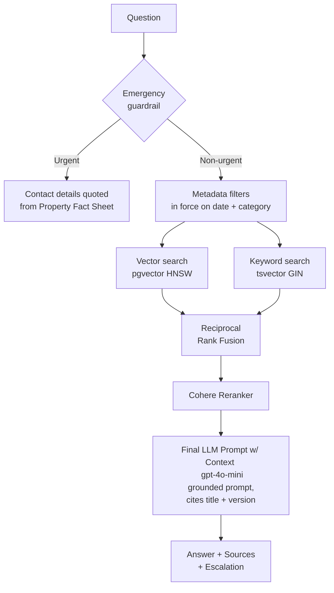
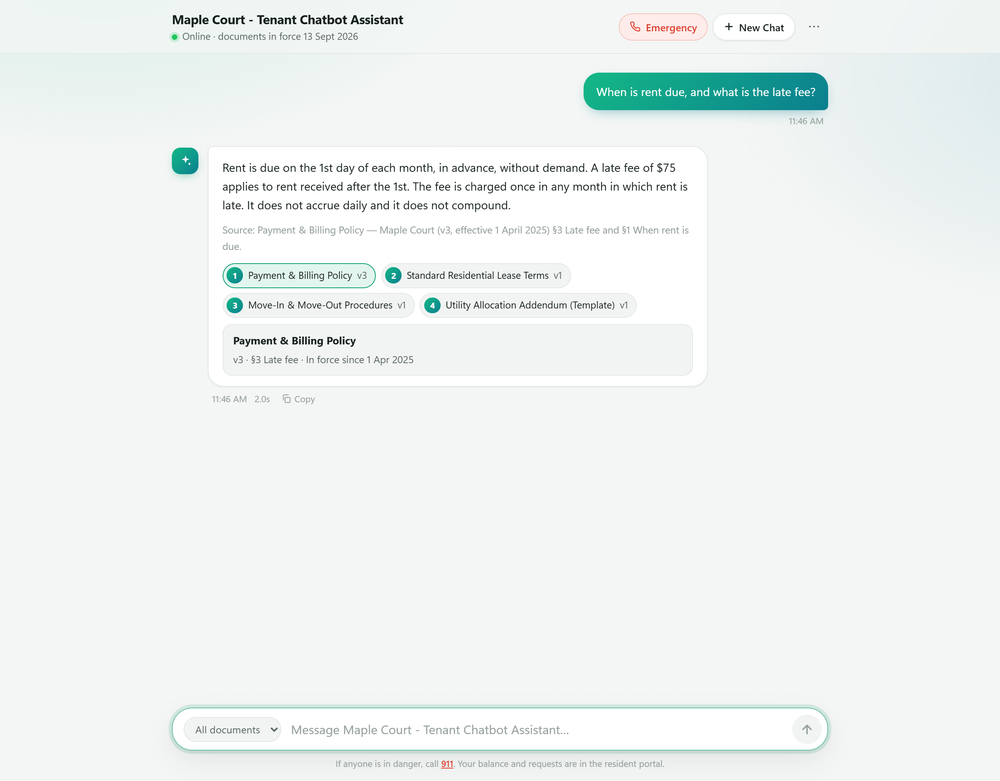
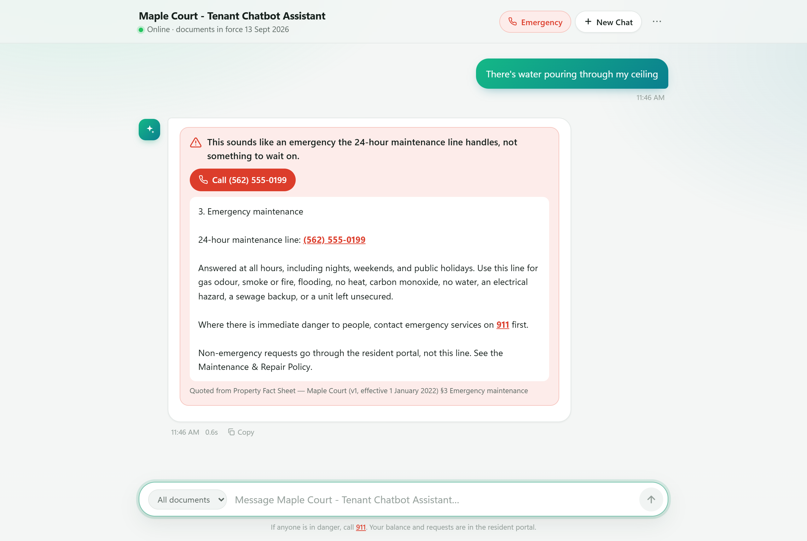

# RAG-Based Resident Assistant

A chatbot that answers residents' questions from a property's lease, policies, and building rules, grounded in official documents. Answers cite the exact document version and section, and guardrails send emergencies straight to a phone number instead of a general response.

## Tech Stack

**Local Stack:** FastAPI, LangChain, PostgreSQL + pgvector + tsvector, OpenAI (`text-embedding-3-small`, `gpt-4o-mini`), Cohere Rerank, Redis semantic cache, RAGAS evals, Docker.

**Production Stack (AWS)**: FastAPI, LangChain, Amazon RDS for PostgreSQL + pgvector + tsvector, Amazon Bedrock (Claude, Titan Text Embeddings V2, Cohere Rerank), Amazon ElastiCache semantic cache, Amazon S3 document store, RAGAS evals, Docker on Amazon ECS (Fargate).

---

## RAG System Design

| Stage | Detail |
|---|---|
| **Ingestion** | Loads `txt`, `md`, `pdf` and `docx` files with LangChain, strips repeated headers and footers, and splits at the 185 section headings in the manifest (900-character chunks, 120 overlap, within a section). Every chunk carries its document version, section and filterable metadata columns. |
| **Storage** | PostgreSQL table holds 1536-dimension `text-embedding-3-small` vectors (HNSW index), a GIN index (tsvector), and indexes on the effective dates, property and document type, and category. |
| **SQL Metadata Filters** | Applied in SQL before both searches. Every search is limited to the property and to documents in force on the question's date (`effective_from <= as_of <= effective_to`), `category` (lease, addenda, policies, rules, disclosures, property), or a `doc_type` (e.g. `payment_policy`).|
| **Hybrid retrieval** | A pgvector dense retrieval (cosine similarity) and a `tsvector` keyword retrieval (`websearch_to_tsquery`, ranked by `ts_rank`) run concurrently, 40 candidates each, and are merged with Reciprocal Rank Fusion (k = 60).|
| **Reranker** | At most 5 chunks per document and 20 in total go to Cohere Rerank (`rerank-multilingual-v3.0`), which keeps the top 8 for the model. |
| **Generation** | `gpt-4o-mini` answers from those 8 chunks with a grounded prompt that requires citing the document title and version. The API also returns each source's section. |
| **Emergency guardrail** | A deterministic pattern classifier runs before retrieval. Danger, maintenance emergencies and safety concerns skip the LLM and get contact details quoted word for word from the Property Fact Sheet. |
| **Escalation** | After answering, the response is flagged if it cites a document marked `escalate` or the documents don't cover the question. |
| **Semantic cache** | Redis caches LLM responses by question embedding, with a tight distance threshold (0.05) so one question is never served another's answer. |
| **Evaluation** | A 49-question golden set, each question pinned to its own date. Deterministic checks (route, source, currency, contacts) plus RAGAS metrics. |

## Architecture Diagram



## Ingestion

**Ingestion** (`app/ingest.py`) reads `data/manifest.json`, which `scripts/build_manifest.py` builds from the raw document metadata. It loads the txt, md, pdf and docx files, strips repeated page headers and footers, splits documents at their section headings, and stores the chunks with nine filterable metadata columns in PostgreSQL. Re-running ingestion replaces the property's chunks rather than duplicating them.

## Evaluation

The pipeline is scored against a 49-question golden set (`seed/qna_test.jsonl`) in two separate ways:

| Deterministic Check | Result |
|---|---|
| Correct route (answer / no answer / escalation / emergency) | 49 / 49 |
| Primary source document retrieved | 40 / 40 |
| Every retrieved document in force on the question's date | 40 / 40 |
| Emergency contact numbers quoted correctly | 5 / 5 |

|RAGAS Metric | LLM Judge Score|
|---|--|
| Faithfulness | 0.98 | 
| Answer relevancy | 0.80 | 
| Context precision | 0.94 | 
| Context recall | 0.99 | 
| Factual correctness | 0.97 |

Full per-question results are in [`eval_results/`](eval_results/).

## Quick start

Requires Docker, an OpenAI API key and a Cohere API key (the free trial key works). 

Check the example `.env.example` file for required keys.

## Project structure

```
app/
  api.py           FastAPI routes: /ask, /ingest, /health
  rag.py           Date filter, retriever with per-document cap, rerank, prompt, escalation
  hybrid.py        Keyword search (tsvector) and Reciprocal Rank Fusion
  escalation.py    Emergency guardrail and post-answer escalation rules
  ingest.py        Manifest-driven loading, boilerplate stripping, section-aware chunking
  utils.py         Vector store, property-local date, schema verification
  static/          Chat UI (HTML/CSS/JS)
data/              21 obfuscated property documents + metadata (see data/README.md)
init-db/init.sql   Table, filter columns and indexes
scripts/
  eval_ragas       RAGAS evaluation
seed/              Golden evaluation set
eval_results/      Baseline evaluation run
```

## Screenshots





## License

[MIT](LICENSE)
